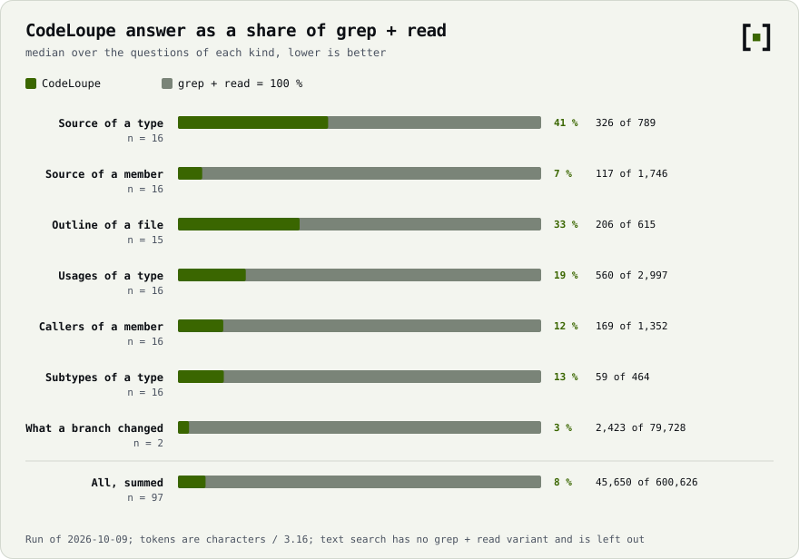
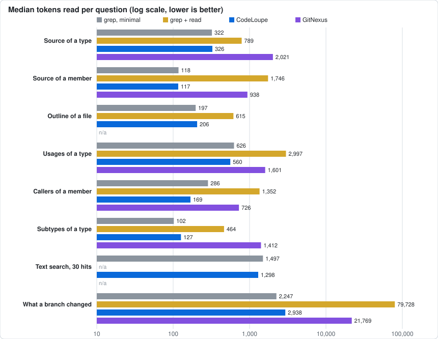

<p align="center">
  <picture>
    <source media="(prefers-color-scheme: dark)" srcset="docs/brand/banner-dark.svg">
    
  </picture>
</p>

# CodeLoupe

On-demand code index for AI coding agents. Ask for a declaration, a file outline, its usages, callers or type
hierarchy, or what a branch changed, and get exactly that piece of code instead of grepping and reading whole files.
With a tracker configured it also mirrors your issues (YouTrack first) and answers issue reads and task queries locally.

- **Any git repository**, no configuration: the base index follows the default branch and is built
  from git objects; every worktree of the repository shares it and adds an overlay of its own changed, new
  and deleted files, checked when a query arrives (no file watchers, no CPU while idle).
- **No IDE**: the Kotlin compiler's own parser (syntax only, no classpath) and SQLite.
- **One daemon per machine** for every agent window, started on demand; heavy builds run one at a time
  in a short-lived child JVM at low priority, so the daemon stays small (about 210 MB resident with two repositories
  indexed, [measured](#benchmarks)).
- **MCP** over Streamable HTTP (stateless) plus the same tools on a CLI.

Languages: Kotlin and Java. Status and roadmap: [docs/plan.md](docs/plan.md) (Czech).

[What it is good for](#what-it-is-good-for) · [Benchmarks](#benchmarks) · [How it differs](#how-it-differs) ·
[Limitations](#limitations) · [Use](#use)

## What it is good for

An agent working on a Kotlin repository keeps asking a few questions: where is this declared, what does this file
contain, who uses this, who calls this, what are its subtypes, what did my branch change. Without an index it answers
them with `rg` and by reading files. CodeLoupe answers each with one call that returns the relevant piece of code.
What the agent has to read, median over the questions of each kind on two public repositories (tokens are characters
divided by 3.16; method and every row in [docs/benchmarks.md](docs/benchmarks.md)):

<picture>
  <source media="(prefers-color-scheme: dark)" srcset="docs/benchmarks-share-dark.svg">
  
</picture>

| Task | Tool | CodeLoupe | grep + read | grep, minimal |
|---|---|---:|---:|---:|
| Read a type | `symbol` | 326 | 789 | 322 |
| Read a member | `symbol` | 117 | 1,746 | 118 |
| Outline of a file | `outline` | 206 | 615 | 197 |
| Who uses a type | `usages` | 560 | 2,997 | 626 |
| Who calls a member | `calls` | 169 | 1,352 | 286 |
| Subtypes of a type | `hierarchy` | 127 | 464 | 102 |
| Text search, 30 hits | `grep` | 1,298 | n/a | 1,497 |
| What a branch changed | `changes` | 2,938 | 79,728 | 2,247 |

*grep + read* is what an agent without an index typically does: `rg` with context lines, a whole-file read, the full
`git diff`. *grep, minimal* is a best case that assumes the agent never reads a line it does not need (for source
lookups it is given the exact line range, for the branch `git diff --stat`). Against grep + read, CodeLoupe's answers
are 4–41 % of the size (8 % summed over all questions) and take one call where grep needs two for source lookups.
Against the best case they are about the same for source lookups and outlines, smaller for usages and callers, and
larger for subtypes and branch changes: CodeLoupe returns more per line (the type itself and its direct supertypes, the
enclosing declaration of every hit, exact against candidate marks, callers and tests of every changed declaration
that was not added), and `git diff --stat` says less.

Beyond navigation, and not part of the benchmark: worktrees of one repository share one index and each adds only its own
edits; long commands run in the daemon so an agent's turn can end ([Jobs and events](#jobs-and-events)); a tracker mirror
answers issue reads locally; `codeloupe metrics` shows from Claude Code transcripts where an agent's context goes
([Measuring agent runs](#measuring-agent-runs)).

## Benchmarks

`node tools/benchmark.mjs` asks the same questions of a grep-and-read baseline, CodeLoupe and
[GitNexus](https://github.com/abhigyanpatwari/GitNexus) over public repositories at pinned commits
(`JetBrains/Exposed` `023a6a3`, 319 Kotlin files without tests; CodeLoupe `f370022`, 457 files), and writes
[docs/benchmarks.md](docs/benchmarks.md), [docs/benchmarks.json](docs/benchmarks.json) and the chart below. Run of
2026-10-08 on Windows 11, i7-13700F, 64 GB, CodeLoupe 0.1.0 (commit `b2a695e`), `gitnexus@1.6.12` from npm.

<picture>
  <source media="(prefers-color-scheme: dark)" srcset="docs/benchmarks-dark.svg">
  
</picture>

Tokens read per question, median over 15–16 questions of each kind (2 for the branch, 6 for text search):

| Task | CodeLoupe | GitNexus | grep + read | grep, minimal |
|---|---:|---:|---:|---:|
| Read a type | 326 | 2,021 | 789 | 322 |
| Read a member | 117 | 938 | 1,746 | 118 |
| Outline of a file | 206 | n/a | 615 | 197 |
| Who uses a type | 560 | 1,601 | 2,997 | 626 |
| Who calls a member | 169 | 726 | 1,352 | 286 |
| Subtypes of a type | 127 | 1,412 | 464 | 102 |
| Text search, 30 hits | 1,298 | n/a | n/a | 1,497 |
| What a branch changed | 2,938 | 21,769 | 79,728 | 2,247 |

GitNexus 1.6.12 has no outline or text-search tool, so those rows are `n/a`. Its `context` answers are JSON cards (callers,
callees, process membership), not the same content as CodeLoupe's, so the comparison is of what is read, not of what is
learned. Both tools answered every question they have a tool for; for 8 of GitNexus's 82 answers (names that exist more
than once) it needed a second call with the file path, and both answers are counted.

Cost of having the tool, same run:

| | CodeLoupe | GitNexus |
|---|---:|---:|
| Tool definitions in the agent's context (`tools/list`) | 13 tools, 3,749 tokens | 17 tools, 22,140 tokens |
| First index, Exposed / CodeLoupe | 7.3 s / 2.7 s | 128 s / 68 s |
| Peak memory while indexing, Exposed | 517 MB | 2,583 MB |
| Memory after the queries | 206 MB daemon, both repositories | 3,325 MB MCP server after 82 queries (114 MB at start) |
| CPU while idle, 30 s | 0 ms | 15 ms |
| Warm call (median, per question kind) | 10–11 ms; 26 ms text search; 750 ms branch changes | 155–213 ms; 214 ms branch changes |
| Index on disk, Exposed / CodeLoupe | 62 MB for both | 1,067 MB / 141 MB |
| Files written into your checkout by indexing | 0 | 8 (`AGENTS.md`, `CLAUDE.md`, `.claude/skills/`; off with `--skip-agents-md` and `--skip-skills`) |

What the numbers do not show:

- They count what an agent reads, not whether it finishes a task; the controlled agent benchmark of
  [docs/plan.md](docs/plan.md) § 8.4 has not been run.
- One run on a shared workstation: token counts are deterministic, timings and memory are indicative and vary between
  runs.
- Two repositories, one of them CodeLoupe's own, questions chosen by a fixed rule that favours grep (names unique in the
  repository). GitNexus's default database buffer pool (428 MiB here) was too small to index Exposed; the benchmark sets
  2 GiB for `analyze`, as the error message suggests. GitNexus's worktree handling and newer builds than 1.6.12 were not
  measured. An IDE-based MCP server cannot be started by a script and is not measured.

## How it differs

| | CodeLoupe | GitNexus 1.6.12 | IDE-based MCP (IntelliJ IDEA's built-in server) |
|---|---|---|---|
| Needs a running IDE | No | No ([README](https://github.com/abhigyanpatwari/GitNexus#readme): CLI and MCP server, editors are clients) | Yes: the server is part of the IDE and serves "the projects opened in the IDE" ([JetBrains docs](https://www.jetbrains.com/help/idea/mcp-server.html)) |
| Languages | Kotlin and Java | 16 listed in its README: TypeScript, JavaScript, Python, Java, Kotlin, C#, Go, Rust, PHP, Ruby, Swift, C, C++, Objective-C, Dart, Zig | Those the IDE supports |
| How references are resolved | Syntax only (the Kotlin compiler's parsers for Kotlin and Java, no classpath); unsure hits are marked `candidate`, never dropped | Graph built from tree-sitter parsers; answers carry an `epistemic` field (`exact` or `lower-bound`) and list unresolved boundaries | The IDE's own semantic model |
| Index | SQLite; the default branch, built from git objects | Embedded graph database (LadybugDB), no database server; built by `gitnexus analyze` | The IDE's indexes |
| Keeping it current | No watchers: the worktree is checked when a query arrives | Re-run `analyze`, or `analyze --watch`; running MCP servers reopen a new index (README) | The IDE |
| Worktrees | One base index, an overlay per worktree; first `changes` in a new worktree took 1.1–5.9 s (measured) | README: linked worktrees share one store, a checkout with uncommitted changes gets its own incrementally updated graph (not measured) | Each opened project |
| Writes into your checkout | Nothing (measured) | `AGENTS.md`, `CLAUDE.md` section, `.claude/skills/` by default (measured; flags turn it off) | n/a |
| Tool definitions in context | 3,749 tokens, 13 tools (measured; more with a tracker configured) | 22,140 tokens, 17 tools (measured) | Not measured by the script; an earlier one-off measurement of an older IDE server: 25 tools, about 12.4k tokens ([context-audit](docs/context-audit.md)) |
| Install | Bundle with its own Java runtime, 135 MB zip ([Bundle](#bundle)); or JDK 25 and Gradle | Node.js 22.18+ (the package's `engines`) and the npm package, 231 MB unpacked (`npm view gitnexus dist.unpackedSize`) | Part of the IDE |
| Beyond navigation | Tracker mirror, task ↔ code links, jobs in the daemon, transcript metrics | Execution flows, impact analysis, route and API maps, Cypher queries, optional embeddings, web UI (README) | Refactorings, inspections, run configurations, debugger, database tools (JetBrains docs) |
| Licence | [PolyForm Noncommercial 1.0.0](LICENSE) | [PolyForm Noncommercial 1.0.0](https://github.com/abhigyanpatwari/GitNexus/blob/main/LICENSE); its README points to the maintainers for commercial licensing | Per the IDE's licence (not examined) |

Facts about GitNexus and the JetBrains server were read from their public documentation and package metadata on
2026-10-08; "measured" means [tools/benchmark.mjs](tools/benchmark.mjs).

Another tool fits better when:

- the repository is not Kotlin: GitNexus (16 languages) or the IDE;
- you need the compiler's exact answer, a refactoring or inspections: an IDE-based server;
- you ask conceptual questions ("how does checkout work"), want execution flows, blast-radius analysis or API route
  maps: GitNexus has tools for them, CodeLoupe has none;
- you search text in files that are not Kotlin or `.kts`: `rg` searches every file type;
- you want only the list of changed files: `git diff --stat` is smaller than `changes` (2,247 against 2,938 tokens);
- the repository is small enough that reading the files costs little.

Both CodeLoupe and GitNexus are source-available under the PolyForm Noncommercial licence, so neither is a free choice
for commercial use; the IDE-based server follows the IDE's licence.

## Limitations

- **Languages**: Kotlin (`.kt`, and `.kts` for text search) and Java (`.java`). Other files are not indexed. In a mixed repository a Java
  file's references to Kotlin top-level functions (`GreeterKt.polite(…)`, the file facade) and Kotlin's synthetic property access to
  a Java getter (`x.name` for `getName()`) are not followed.
- **Syntax-level resolution**: no classpath, no compiler. Overloads are told apart by argument count, receivers by the
  types syntax shows, so some references stay `candidate` and a name shared by unrelated declarations must be
  qualified (`Type.member`). `usages` counts resolved references, not every line that holds the word.
- **Search**: no semantic or conceptual search, no execution-flow or impact analysis; `find`, `grep`, `usages`, `calls`,
  `hierarchy` work on names.
- **Runtime**: git ≥ 2.31, and the bundle or JDK 25. One daemon of about 200 MB; a repository's first query builds its
  index (seconds for the repositories measured, longer for larger ones; the largest measured has 802 Kotlin files including tests).
- **Licence**: source-available under [PolyForm Noncommercial 1.0.0](LICENSE), not open source in the OSI sense. It
  allows personal, research, educational and other noncommercial use and does not allow commercial use without
  agreement with the licensor. GitNexus is under the same licence; check your own situation before choosing either.
- **Evidence**: the benchmark measures answer size, latency and resources, not agent task success; it covers two
  repositories and one machine. Treat the percentages as a measurement of these cases, not a general guarantee.

## Requirements

git ≥ 2.31 and either the [bundle](#bundle) (it carries its own Java runtime) or, to build from source, JDK 25
(Gradle finds or downloads it as a toolchain).

## Use

```bash
./gradlew installDist
build/install/codeloupe/bin/codeloupe outline OrderService          # from inside a repository
build/install/codeloupe/bin/codeloupe symbol "OrderService.handle(_)"
build/install/codeloupe/bin/codeloupe find "*Repository" --kind interface
build/install/codeloupe/bin/codeloupe usages OrderService.handle
build/install/codeloupe/bin/codeloupe calls OrderService.handle --depth 2      # --callees for what it calls
build/install/codeloupe/bin/codeloupe hierarchy Repository
build/install/codeloupe/bin/codeloupe issue ABC-5 --section scope   # with a tracker configured
build/install/codeloupe/bin/codeloupe tasks "epic: ABC-1" --mode ready
build/install/codeloupe/bin/codeloupe task_code ABC-5            # its landed or predicted code
build/install/codeloupe/bin/codeloupe code_tasks OrderService.handle   # the tasks that touched it
build/install/codeloupe/bin/codeloupe task_context ABC-5         # a planner's whole starting pack; asked again: what changed
build/install/codeloupe/bin/codeloupe doc plan.md --section goal # a text file by digest, section or line window
build/install/codeloupe/bin/codeloupe run -- git log -30         # a short command: its summary, the rest by handle (doc path=job:<id>)
build/install/codeloupe/bin/codeloupe env list                   # secret names, scopes and last use; never a value
build/install/codeloupe/bin/codeloupe env run --repo repo -- docker compose up   # a command with the secrets in its environment
build/install/codeloupe/bin/codeloupe status
```

The first query in a repository builds its index (seconds); later queries take milliseconds. The
daemon starts on the first CLI call; `codeloupe start` / `stop` manage it explicitly.

A CLI call against a running daemon takes ~0.2 s. The start script keeps a JVM class-data archive in
`<home>/cds/` (about 8 MB per install and build); the first call after an install creates it (~1.5 s), and it is
simply not used when that directory is not writable. `JAVA_OPTS` / `CODELOUPE_OPTS` add JVM flags.

### Claude Code

Two ways to connect, both ending in the same MCP server (`http://127.0.0.1:47391/mcp`, header `x-codeloupe: 1`, no secret).
`codeloupe` must be on `PATH` (the [bundle](#bundle)'s `bin/`) for the session hook; without it the plugin still works
while the daemon runs (tray app, `codeloupe start`).

**1. Plugin (recommended)** — MCP server, a skill saying which tool to use when, and a `SessionStart` hook that runs
`codeloupe start`, so the daemon is up with the session. The repository is its own marketplace:

```bash
claude plugin marketplace add Terrio-cz/CodeLoupe      # or the path of a checkout / the app's claude-plugin folder
claude plugin install codeloupe@codeloupe              # --scope user (default) | project | local
```

The plugin lives in [plugin/](plugin/) (`.claude-plugin/plugin.json`, `.mcp.json`, `hooks/`, `skills/codeloupe/`) and the
marketplace manifest in [.claude-plugin/marketplace.json](.claude-plugin/marketplace.json). Check changes with
`claude plugin validate plugin --strict` and `claude plugin validate .`; try it for one session without installing:
`claude --plugin-dir plugin`. Hook settings: `CODELOUPE_BIN` (launcher if not on `PATH`), `CODELOUPE_HOOK_VERBOSE=1`
(print why it did nothing). The hook needs `bash` (Git Bash on Windows, which Claude Code uses anyway) and never fails a session.

**2. MCP entry only** — no skill, no autostart:

```bash
claude mcp add --transport http --scope user codeloupe http://127.0.0.1:47391/mcp --header "x-codeloupe: 1"
```

**From the desktop app**: Settings → *Claude Code* shows whether `claude` is found and what is connected, and the
buttons *Připojit plugin…* and *Přidat jen MCP server…* run exactly the commands above (after a native confirmation that
lists them, with the daemon's current port), through the `claude` CLI, so Claude Code writes its own configuration.
Without `claude` on `PATH` the card shows the commands to run by hand. The plugin is added from the marketplace folder
next to the app (`resources/claude-plugin` when packaged, `CODELOUPE_PLUGIN_DIR` to override, the repository root in a
development run); the installers ship `.claude-plugin/marketplace.json` and `plugin/` there. The plugin's session hook
looks for `codeloupe` on `PATH`; an installed app does not put it there, so set `CODELOUPE_BIN` to
`<install>/resources/codeloupe/bin/codeloupe` (`.bat` on Windows) or add that directory to `PATH`.

A daemon on another port: set `CODELOUPE_PORT` for it and for Claude Code (the plugin's URL reads it); for the MCP entry
the app writes the port it watches, and `codeloupe mcp-config` prints the entry for the configured one.

Tools take `root` — the absolute path of the repository or worktree to answer for.

| Tool | Returns |
|---|---|
| `find` | declarations by name, `Type.member` or glob: `path:lines [container] signature` |
| `outline` | members of a file or type with line ranges, no bodies; without a target a map of the repository: files ranked by how much the rest of the code refers to them (PageRank over name references), their types as one-line signatures, cut to `budget` tokens (default 1500); `focus` (files or symbols) puts them first and ranks their neighbourhood, references counted both ways |
| `symbol` | one declaration's source (KDoc, annotations, body) by `Type.member`, `member(ParamType)`, `pkg.Type` or `File.kt:line`; large types collapse to header + members |
| `grep` | text search in the indexed source (Kotlin, `.kts` and Java files, worktree edits included) for string literals, SQL, annotation arguments, config keys: literal by default (`regex=true`, `ignoreCase=true`), hits grouped by file and enclosing declaration, one code line each; `module`, `test`, `limit` narrow it |
| `context` | a declaration's source, its direct callers and the declarations it calls in one answer (`symbol` + `calls` depth 1) instead of three calls |
| `usages` | every reference to a declaration, grouped by file and enclosing declaration, one code line each, `=` exact or `?` candidate; a superset of what `rg -w` finds in code, references that resolve elsewhere only counted (`all=true` lists them) |
| `calls` | callers (default) or callees as a tree, depth ≤ 3; below the first level only exact links |
| `hierarchy` | supertypes and subtypes of a type (object expressions included, and lambdas converted to a `fun interface`), or what a member overrides and what overrides it |
| `job` | start a long command in the daemon (status, cancel); see [Jobs and events](#jobs-and-events); takes `cwd`, not `root` |
| `run` | a command that ends soon (`command` = argv, `cwd`; `timeoutSec`, default 120) answered with a summary instead of its output, as a job (same policy hook, log and scrubbing as `job`). Header: `<command> · exit 0 · 8700 → 380 chars (96% less) · full output: doc path=job:<id>`. git status = branch and a count with names per kind; git log = one line per commit (a shared author or day said once); `git diff --stat` = totals and the 12 biggest files, a patch = one line per file with `+added -removed`; Gradle = the `BUILD` line, task counts, failed tasks, every failed test with its exception and first-party frames, every `e:` compiler error (working directory cut off), a few warnings, `What went wrong`; node:test, Jest, pytest, Maven = counts, failures and last lines; anything else = first 5 lines, every error line (more than 20 are counted) and the last 10, repeated lines folded. An output under 600 characters and 20 lines is returned as it is, `raw=true` returns everything. A command still running after the timeout answers with its job id. The recorded outputs behind the claims are in `src/test/resources/outputs` (about 88 % less over the set; git status, git log and a Gradle failure each at least 60 %) |
| `changes` | what the worktree changed against the merge-base with the default branch (committed and uncommitted), by declaration: `+` added, `~` body changed, `^` signature changed (with the old one), `-` removed; each with its callers and tests; `bodies=true` adds a line diff per declaration |
| `task_code` | links between tasks and code, from the default branch's history (works without a tracker). `query` = a task id (`TER-5`): its landing commit, files and changed declarations (`+ ~ ^ -`), the worktree whose branch names it, and for an open task the touch set predicted from its text — `=` sure · `~` likely · `?` guess · `+` new file, each with the issue text it comes from. `query` = a declaration (`Type.member`) or a file path: the tasks that changed it, newest first, with landing commits (`code_tasks <symbol\|path>` on the command line), plus open tasks whose text points at it. Task ids follow the tracker projects, or `taskPattern` (a regular expression) in `.codeloupe.json` |

`doc` works without a tracker and reads a text file (a plan, a brain note, a large persisted tool output) without re-reading it; see [Documents](#documents).

With a tracker configured (see Configuration) more tools work on a local mirror of its projects:

| Tool | Returns |
|---|---|
| `issue` | one issue as compact markdown: `view=brief` (fields, links, criteria checklist, section index), `full`, or `sections=[…]` (description headings by prefix, `criteria`, `fields`, `links`, `comments`, `attachments`, `history`). A second read from the same `root` answers `unchanged since …` or only what changed; `since=<ISO time>` diffs against that time, `since=none` shows it again |
| `similar` | before creating an issue: the open (or last 90 days resolved) tasks that talk about the same thing as a draft `summary` / `description`, best full-text match first (bm25, summary weighs most), each with the words it shares; extend or link one instead of creating a duplicate. From the mirror, in well under 100 ms |
| `task_context` | a planner's starting pack for a task in one call instead of `issue` + `tasks` + `task_code` + search: sections `issue` (brief with criteria), `linked` (dependencies and relations with state), `open-criteria` (what related open tasks still owe), `touch` (landed, in a worktree, or predicted code), `declarations` (outline lines of those files, no bodies), `prior` (earlier tasks that changed the same files, each with its landing commit). `sections=[…]` picks some, `view=digest` lists them with sizes. The same `root` asking again gets `unchanged since …` in one line, or only the sections that changed; `since=none` sends everything again |
| `dispatch_plan` | which ready tasks get a window now so that no two windows touch the same code. Candidates: `candidates=[ids]`, `epic=<id>` (its open leaf tasks), `query=<filters>`, or none (the 15 most urgent open leaf tasks). Each task's touch set is its landed files, else what its text names (as in `task_code`); sets are compared with each other and with every live worktree (the files it changed plus what its task is predicted to touch). Answer: `windows` — a batch of up to 3 light tasks, a chain of up to 3 steps (dependencies first), or one task, each with the shared code that put its tasks together and per-task keys (`file:`, `dir:`); `waiting` — fights with a live worktree (file and worktree cited), unmet dependency, no free slot (`slots`, default 4), rest of a long chain; `live`. A task whose text names no code is listed as unproven. `width=dir` (default) counts one directory as a clash, `file` only one file; markdown never blocks. Same `sections` / `view` / `since` as `task_context`. The caller keeps the final judgment |
| `tasks` | one line per task (`id state · type · priority ‹epic› title ⛔blockers`). `mode=list` with a YouTrack-like `query` (`project: TER state: -Done #unresolved epic: TER-1 type: Bug {Fix versions}: 1.0 sort: id` plus full-text words), `graph` (an issue's epic, dependencies, subtasks, relations; `depth` ≤ 3), `ready` (open tasks without open subtasks whose dependencies are resolved and that no git worktree branch holds), `progress` (an epic: counts by state, criteria, blockers, open tasks) |
| `update` | writes to the tracker: `set={Field: value}` (State, Assignee, Priority, Type, `summary`, `description` or any custom field; comma-separated for multi-value fields; an empty value clears) and/or `comment=<text>`. Answers one line of at most 300 characters — the fields that changed (`State: To do→Done`), `+comment <id>`, and the state when it did not change — instead of the issue. The mirror stores the tracker's own answer to the write, so the next `issue` read needs no request |

Usages are resolved without an IDE or compiler: the scopes, imports and aliases a file sees, the receiver's
type where syntax tells it (declared types, `Type(…)`, what a call returns, collection elements in lambdas), and
overloads by argument count. Unsure hits are marked, never dropped. One heuristic: on a receiver of unknown type,
a name the index declares only once (and no library declares, judging by the core API and the files' imports) is
taken as exact. A name that matches several unrelated declarations must be qualified (`Type.member`).

## Secrets

One store for the variables and secrets that Claude workspaces, MCP servers and scripts use, so that they live in one place
and an agent never sees a value. `<home>/secrets/vault.env` (JSON) holds one AES-256-GCM ciphertext per name and scope, bound
to its name and scope, and a random data key that only the OS can open: Windows DPAPI (current user), the macOS login
Keychain, libsecret (`secret-tool`) on Linux, else a key derived from the passphrase in `CODELOUPE_PASSPHRASE` (PBKDF2-HMAC-SHA256,
310 000 rounds). A vault is always opened the way it was made. The file name ends in `.env` on purpose: the workspace rules that
deny reading `*.env` cover it.

| | |
|---|---|
| `codeloupe env set NAME --scope global\|workspace:<id>\|repo:<id> [--source …]` | stores or rotates a value; read from stdin (a hidden prompt on a terminal), never from an argument |
| `codeloupe env list [--workspace w] [--repo r] [--all]` | name, scope, source, created, rotated, last use and by what — metadata the file holds in the clear; no key is touched |
| `codeloupe env unset NAME --scope …` | removes it |
| `codeloupe env run [--workspace w] [--repo r] -- <command>` | the command's environment gets every secret that applies (global < workspace < repository, the narrowest wins); what it prints is masked line by line of every stored value |
| `codeloupe env audit [--name N] [--scope S] [--limit 50] [--consumers] [--json]` | the append-only audit (`<home>/secrets/audit.log`): every read by consumer, creation, rotation and removal with time; `--consumers` sums up who read each name. Names and times, never a value |
| MCP tool `env` | the same names, never a value; `workspace`, `repository`, `all` |
| `codeloupe env import scan [--include-excluded] [--json]` | inventory of the variables in `.env` and docker env files, `.claude/settings*.json` `env`, `.mcp.json` and `~/.claude.json` MCP server `env` under the configured roots: name, suggested scope, every source, duplicates and conflicts (equal or different values, compared by a hash that is salted per report), what the store already holds. Never a value |
| `codeloupe env import run --select <id>[=scope] … \| --all-sensitive [--replace] [--overwrite]` | copies the selected occurrences into the store inside the process and reports created / updated / skipped; rerunning changes nothing. Two selected sources with different values for one name and scope are a conflict, stored from neither. `--replace` then swaps each imported value in its source for a reference (a comment in dotenv files, `${NAME}` in JSON) after saving an encrypted copy of the file |
| `codeloupe env import rollback <backup-id> [--force]`, `backups`, `forget <id>` | puts every replaced file back byte for byte (a file edited since is left alone unless `--force`); lists and drops the copies |
| `GET /env/values?workspace=&repository=&names=A,B` | for a local MCP server or script: the values, in its own process. Needs `x-codeloupe-env-token` (the contents of `<home>/secrets/api-token.env`, made on first use, readable by this user only) and says who asks in `x-codeloupe-used-by` |

The import looks under the roots of `envImport` in `<home>/config.json` (`{"roots":[{"path":"~/IdeaProjects","kind":"repositories"}],"exclude":["tnt"]}`; kind
`home`, `workspaces` or `repositories`). Without it: every `~/.claude*`, `~/Documents/Claude` (each folder one workspace, scope `workspace:<folder>`) and `~/IdeaProjects`
(the nearest folder with `.git`, scope `repo:<folder>`). Folders whose name holds an `exclude` word (default: TNT, FoodRetailor and their sibling services) are listed, not
entered, until `--include-excluded`. Templates (`.env.example`), build and dependency folders and the daemon's own home are never read. MCP `headers` and `args`,
compose `environment:` blocks and shell profiles are not scanned.

A name that has been as it is for longer than `secrets.rotationDays` in `config.json` (default 90, 0 = off) is flagged `ROTATE` in `env list`, in the `env` tool and
in the Environment screen; rotating it (`env set` again) starts the age anew. The audit keeps about 8 MB of history (`audit.log` and `audit.log.1`).

Every text that leaves the daemon (events, webhooks, summaries, `run` answers, `doc path=job:<id>`) is masked of the stored values
(six characters or more) before the pattern rules for other secret shapes, and a finished job's log file is rewritten with the
values replaced by `***`, byte exact otherwise. Masking is by value: a program that transforms a secret before printing it (base64,
split over lines) is not covered. A value on a command line is visible to this user's other processes while the command runs; use `env run`
or the API instead. The Terrio workspace guard (`.claude/hooks/guard.ps1`) should deny reads of `…/codeloupe/secrets/` (add it to its
`SecretFiles` pattern); until then only the `Read(**/*.env)` rule of `settings.json` covers the Read tool.

## Accounts

`<home>/accounts.json` lists the Claude Code accounts of this machine (each a config directory, `CLAUDE_CONFIG_DIR`) and the YouTrack instances to mirror; the
desktop app writes it, the daemon reads it afresh on every call. Without it the one account is `~/.claude`. The transcripts of every listed account are ingested
(`<configDir>/projects/*`) and attributed to it by the folder they lie in, so `GET /ui-api/v1/accounts` shows each account's cost for 7 days, last use and working directories
that called CodeLoupe in the last 15 minutes, and `GET /ui-api/v1/overview?account=<id>` narrows the Overview to one. A YouTrack account is `{ id, label, url, projects, token }` where
`token` is the name of a global secret in the store (`YOUTRACK_TOKEN_<ID>`); the daemon mirrors it like a tracker of `config.json` (a tracker of that file wins a name clash), reading the
token from the store at most every 30 seconds. The API never returns a token, only whether one is stored.

## Documents

One layer serves every large text an agent would otherwise read twice: `doc` (plans, brain notes, persisted tool outputs)
and `task_context` (the planner's pack) both split their text into **sections with handles** (markdown headings and
`=== title ===` banners; an output without headings is cut into line windows `L1-60`, `L61-120`, …), hash each section and remember,
per caller (`root`), what that caller was shown.

| Call | Answer |
|---|---|
| `doc path` | a digest of at most 1000 characters: size, hash, the sections as `handle(lines)`, the lines that look like errors as `L118-124 "FAILED: …"`, and how to fetch |
| `doc path --section goal --section L118-124` | those sections (handle or heading prefix, with their sub-sections) or line windows (at most 300 lines, 20 000 characters) |
| `doc path --view outline` / `--view full` | every section with its line; the whole text |
| `doc job:<id>` | the full output a `run` or `job` kept, scrubbed of secrets, by the same digest (error windows `L118-124 "FAILED: …"` included), sections and line windows; the newest 8 MB of a larger log |
| the same call again | one line, `plan.md unchanged since your read at … (#hash, 9 sections)`, under 100 tokens |
| after the file changed | the digest becomes a delta (`~ steps(12)`, `+ notes(3)`, `- old`); `--view full` sends only the changed sections in full and names the omitted ones; a fetched section that did not change answers `section steps unchanged` |
| `--since none` | forget what the caller has; read it again |

`doc` reads only files under the caller's `root` or under the agent harness's folders (`~/.claude`, `<tmp>/claude`), with links
resolved first, and never a secret store (`.env*`, `*.pem`, `*.key`, `id_rsa*`, `credentials*`, `.ssh`, `.aws`, …), a binary file or one over 8 MB.
The memory is per daemon and per `root`; it is not saved over a daemon restart (the next read is a full one).

## Jobs and events

Long commands (tests, builds, deploys) run in the daemon instead of in an agent's turn: the agent starts a job, ends
its turn, and is woken once when it ends — or not at all when the follow-up is deterministic.

```bash
codeloupe job start --slot gradle-test -- ./gradlew test     # prints the id at once
codeloupe job wait J261007-142233-x7k2                       # as a background task: blocks, no time limit
codeloupe job start --wait -- node run/build.mjs              # both in one call
codeloupe job status [id]  ·  codeloupe job cancel <id>
```

- **Detached**: a job is a child of the daemon, not of the agent session; it outlives the turn and the session. On
  Windows the daemon is started outside the caller's job object (headless `claude -p` runs kill theirs at turn end),
  and jobs run in the daemon's own kill-on-close job object: if the daemon dies they end too, never as orphans.
- Output and errors go straight to `<home>/jobs/<id>.log`; the record (`<home>/jobs.db`) keeps exit code, duration and a
  **compact summary**: test counts (Gradle, Maven, node:test, Jest, pytest), the first failure lines, the last 15 lines.
- **Slots**: `--slot <name>` holds a named resource while running; a busy slot queues the job in the daemon (first come,
  first served). `config.json` `slots` sets capacities (`{ "gradle-test": 2 }`); a slot not listed holds one job.
- **Policy**: commands run by the daemon never pass the agent host's guard hooks, so every job — follow-ups included,
  and again after a slot wait — is first fed to `policyHook` exactly as Claude Code feeds a PreToolUse hook for a Bash
  call (`tool_name` `Bash`, `tool_input.command` = the argv quoted for Bash with `--env` values as `K=v` prefixes, `cwd`).
  Only an allow (or no output) starts it; deny, ask, exit 2, a crash, a timeout or unreadable output refuse it (exit 2,
  no record). The hook runs in the daemon's environment, so a caller cannot redirect it with variables of its own; and
  the daemon's environment is not its starter's: on Windows it is the user's own (Win32_Process.Create), elsewhere the
  starter's cut to `HOME`, `USER`, `PATH`, `LANG`, … Protect `config.json` like any other policy file; the CLI refuses a
  daemon on its port whose home is not its own.
- No shell: the command is an argv (`bash -c '…'` for pipes). On Windows `./gradlew` or `npm` resolve to their
  `.bat`/`.cmd` like in Bash (a bare name only on `PATH`); a batch file refuses arguments holding `& | < > ^ % ! " ( )`,
  which cmd.exe would parse again. The job gets the daemon's environment plus `--env K=V` (values never stored or
  emitted).
- **Wait once**: `job wait` long-polls the daemon (5 min per request, re-sent, across daemon restarts) until the job and
  its follow-ups end, prints the compact report and exits with the job's code. A restarted daemon reports queued and
  running jobs as `lost`, keeps their logs and ends what survived of them. `codeloupe stop` refuses while jobs run
  (`--force` ends them). `job cancel <id>` ends the live job of the chain and its whole process tree; after a cancel no
  job steps run, `notify` and `webhook` steps still do.
- **Completion actions** (`--then` after success, `--on-failure` after a failure, in order): a closed set of typed
  steps, never a shell string — `job[@slot]:<command line>` (a follow-up job; the steps after it continue when it ends),
  `notify[:message]` (a `job.notify` event that wakes the agent), `webhook:<url>` (the `job.finished` event to a URL).
  Any step can carry a condition on exit code and summary: `failed==0 && tests>0 ? notify:green` (fields `exit`,
  `tests`, `passed`, `failed`, `skipped`, `seconds`; a count the log did not report never matches).
- **Wake**: the last `job.finished` of a chain carries `wake` — by default true only when something failed if the job
  declared `--then` steps, else always (`--wake always|failure|never`). A launcher subscribed to `job.finished` /
  `job.notify` resumes a headless session only when `wake` is true; `--tag` (default `CODELOUPE_JOB_TAG`) tells it which.
- MCP: one tool, `job` (`action` start / status / cancel); waiting is the CLI's job.

**Events**: `job.started`, `job.finished`, `job.notify`, `build.done`, `overlay.refreshed`, numbered (`seq`) and kept in
`<home>/events.db`, scrubbed of secret-looking values (tokens, passwords, `Authorization`, URL credentials) before they are
stored. `GET /events?since=<seq>`; `GET /events/stream` is a server-sent-events stream that resumes after `Last-Event-ID`.
**Webhooks**: `codeloupe webhook add <url> [--event job.*]` persists a subscription; each delivery is a JSON POST signed with
`x-codeloupe-signature: sha256=HMAC(<home>/webhook.key, "<x-codeloupe-timestamp>.<body>")`, retried after 2 s, 10 s,
1 min, 5 min and 30 min (also after a daemon restart), logged (`webhook deliveries`). Targets are this machine only, any
port but the daemon's, unless `remoteWebhooks` lists the https origin; redirects are not followed.

## Workspaces

`codeloupe workspaces [--repo <path>] [--state orphan] [--size] [--ram] [--json]` and `GET /workspaces?repo=&size=1&ram=1` (JSON, for the
app) list every worktree of the configured repositories: role, branch, task id (from the branch name, else the directory
name, by the repository's task pattern), commits ahead of the default branch, the task's state from the tracker mirror,
last activity (newer of the HEAD commit and the last git operation in the worktree) and, with `size`, disk size and, with `ram`, the
working set of the processes that work in the directory and how many they are.
State: `active`; `landed` (everything is on the default branch and the task is resolved or has commits there);
`abandoned` (unmerged work, idle for more than `abandonedDays`); `orphan` (a directory under a worktree root git has no
worktree for, or a worktree whose directory is gone). Nothing is removed: orphans are only reported. Git is read in-process,
no `git` process runs. The first call in a repository waits for the scan of its history (`task_code` shares it).

```json
{ "workspaces": { "abandonedDays": 14, "repos": [ { "path": "C:/ws/Terrio", "roots": ["C:/ws/terrio-worktrees"] } ] } }
```

Repositories also come from a tracker's `repos` and from the repositories the daemon has served; `<repo name>-worktrees`
beside a repository is always a root.

### Docker resources

Every container, image, volume and network that is made through CodeLoupe carries three labels naming its owner:
`codeloupe.repo` (the repository's main worktree), `codeloupe.workspace` (the worktree directory) and `codeloupe.task`
(the workspace's task id, empty for one without). The workspace is the one of the directory you run in (`--dir` names
another), found through the registry above.

```
codeloupe ws up [-f compose.yaml] [-p project] [--profile x] [--env-file f] [--project-directory d] [-- up-args]   # default: -d
codeloupe ws run [--dir d] <docker run arguments>
codeloupe ws build [--dir d] <docker build arguments>
codeloupe ws volume create <name>
codeloupe ws resources [--class owned|adopted|unowned] [--json]     # GET /resources
```

`ws volume create` and the inventory use the Docker Engine API (named pipe `\\.\pipe\dockerDesktopLinuxEngine` /
`docker_engine`, or a unix socket; `DOCKER_HOST` with `npipe://` or `unix://` is honoured): no `docker` process, no
output parsing. Compose, build and the full `docker run` command line are client side, so those three call `docker`
with the labels added and check the result through the API: `ws up` reads `docker compose config --format json` and adds
the labels through a generated override file to every service (containers), to `build` (images the project builds),
and to the project's own volumes and networks (not to `external` ones); `ws build` passes `--label` and verifies the
image; `ws run` passes `--label` and first creates the named volumes it mounts, labelled (Docker would create them
without). A `codeloupe.*` label given by the caller is refused, a volume that exists and is not the workspace's is
never relabelled. Exit code 3: something the command made came out without the labels. Images a project only pulls
are not created by CodeLoupe and carry no labels.

`ws resources` lists what exists, by owner: **owned** (the labels), **adopted** (an adoption rule of the config maps its
name to a workspace, for resources made before the labels existed) and **unowned**, which is only reported — nothing
in CodeLoupe changes a resource it does not own, and adoption itself changes nothing in Docker: it is this mapping.
Owned and adopted rows show the workspace's state in the registry (`not in registry` when its worktree is gone).

```json
{ "workspaces": { "adoption": [
  { "repo": "TerrioImporter", "match": "^terrio-ter-(\\d+)(?:[-_].*)?$", "workspace": "TER-$1", "task": "TER-$1" },
  { "repo": "TerrioImporter", "match": "^(?:terrio-)?importer-app:ter-(\\d+)(?:-.*)?$", "kinds": ["image"], "workspace": "TER-$1", "task": "TER-$1" }
] } }
```

`match` is a case-insensitive regular expression tried against each name of the resource (container name, image
`repo:tag`, volume or network name) and against the compose project it belongs to; `$1`… stand for its groups. Rules are
tried in order, the first one wins, labels beat rules. Containers, volumes and networks are also matched by their compose
project. Images are not, by default: compose labels an image with the project that built it, but images get re-tagged and
shared between tasks (`aot`, `jdk25`), so the project alone does not make one a task's leftover. A rule with
`"matchProject": true` (and `"kinds": ["image"]`) adopts the untagged and re-tagged images a stack built; the `via`
column says which name matched.

### Cleanup of released workspaces (reconciler)

`codeloupe ws reconcile` is the dry run (`GET /reconcile`): for every owned or adopted resource and every orphan
directory it says what the policy does and why. Unowned resources are not in it at all.

| verdict | when | what happens |
|---|---|---|
| `auto` | labelled by CodeLoupe, its workspace has **landed**, no container of the workspace runs, older than `graceMinutes` | removed without asking, if `auto` is on |
| `confirm` | adopted by a rule; or the workspace is abandoned, an orphan, or gone from the registry; or landed but still running; or an orphan directory under a worktree root | removed only when named: `ws reconcile --confirm <key>` or `--workspace TER-420` |
| `keep` | the workspace is active; its repository is not in the registry; younger than the grace period | stays |
| `protected` | a `protect` rule of the config matches | never touched, whatever else holds |

`--run` (or `POST /reconcile/run` with `{"confirm": [keys], "workspaces": [names]}`) does it now: the `auto` entries plus
what is named. A named `keep` or `protected` entry is refused. The plan is re-read from the registry and Docker for every
run, so a stale key removes nothing it should not. Removal goes through the Engine API, containers first (stopped, removed
with their anonymous volumes), then networks, volumes, images, never forced: a resource that is in use is *blocked*, not
killed. An orphan directory is deleted without following links; a file that is still locked (Windows) leaves it blocked.

Blocked and failed targets are retried with a growing wait (`retryBaseMinutes`, doubling up to `retryMaxMinutes`), kept
in `<home>/reconcile-state.json`, so the backoff survives a restart of the daemon or the PC. A removal someone confirmed
is retried without a second confirmation. With `auto` on the daemon runs the `auto` entries shortly after it starts, after
a job finished, every `intervalMinutes` while a client has called the daemon in the last 15 minutes, and whenever a retry
falls due. Every attempt is written to `daemon.log` and `<home>/reconcile.jsonl` and emitted as a `reconcile.action` event.

**Release instead of cleanup.** `codeloupe ws release <worktree directory | worktree name | task id> [--repo <path>]`
(`POST /workspaces/release`) marks a workspace released and returns at once, whatever Docker or a lock is doing: it writes
one small file (`<home>/releases.json`) and wakes the reconciler in the background. Every resource of that workspace,
labelled or adopted, whatever state the workspace is in and whether its containers run, becomes an `auto` entry
(`released` in the plan) and is removed with the usual retries, **also with `auto` off**: the release is the
confirmation. A protect rule still wins. A mark covers what the workspace had created up to the release, so a new
workspace of the same name is not cleaned by an old mark, and it goes when nothing of it is left (or after 30 days).
`ws release --list` (and `releases` in `codeloupe status`) shows what is left of each release and what is retrying.
The main worktree cannot be released. A close-out step calls `ws release` instead of `docker compose down` and the
cleanup of leftovers.

```json
{ "workspaces": { "reconcile": { "auto": true, "intervalMinutes": 30, "graceMinutes": 60, "retryBaseMinutes": 1, "retryMaxMinutes": 360,
  "protect": [ { "match": "^terrio-importer(_|$)" }, { "match": "^terrio-importer_terrio-postgres-data$", "kinds": ["volume"] } ] } } }
```

`auto` is off by default. `protect` patterns are regular expressions tried (case-insensitively, anywhere in the name,
so anchor them) against each name of a resource and its compose project; without `kinds` they also cover directories.

### Processes and build daemons per workspace

`codeloupe ws processes [--workspace TER-5] [--json]` (`GET /processes`) lists the processes that work in a workspace
directory and the memory each workspace holds. A process belongs to the workspace whose directory holds its working directory
(the deepest one when worktrees sit inside the main checkout), or else the one whose path appears in its command line (at a path
boundary: `TER-5` is not `TER-50`). The working directory comes from the process itself: `/proc/<pid>/cwd` on Linux, `lsof` on
macOS, the PEB of the process on Windows. Another user's or a protected process is not seen. A Gradle daemon works in the project's
directory only while a build runs and goes back to its own directory after it, so an idle daemon is placed by its own log
(`<gradle user home>/daemon/<version>/daemon-<pid>.out.log`: the directory of the last `Received command: Build{…}` and the last
`Marking the daemon as busy / idle`; the Gradle user home is `workspaces.gradleUserHome`, `GRADLE_USER_HOME` or `~/.gradle`).
An idle daemon left behind by a finished task is what keeps hundreds of MB, and on Windows what keeps the worktree directory
from being deleted, which is why the reconciler stops it. `via` in the output says whether a process was placed by its
`cwd`, by its `last build` or by its `command line`.

The reconciler plans **build tools only**: Gradle daemons and workers, and the Kotlin compile daemon. Other processes (an editor, a
shell, a dev server) are listed and never touched. A build tool of a **released** workspace is an `auto` entry (`process:<pid>:<start>`)
and is stopped without asking, also with `auto` off, once it is checked again at the moment of the stop: it is the same process (pid
and start time), still a build tool, still placed in that workspace, **idle** (Gradle's own log does not mark it busy, and neither it nor
its children use CPU for 0.6 s) and no `gradlew` build runs in that workspace. The Kotlin daemon serves every workspace, so it waits for any running Gradle build. A process
that fails these checks is *blocked* and retried with the usual backoff. Processes of a workspace that landed, was abandoned or is an
orphan are `confirm` entries (`ws reconcile --confirm process:…`), those of an active workspace are kept. A `protect` rule that
matches the command line, the working directory or the workspace path keeps a process untouched. Only processes of registered
workspaces are ever considered, so processes of other projects are not.

### Ports per workspace

With `"ports": { "range": [19000, 19999] }` under `workspaces`, a workspace asks for a port by name:
`codeloupe ws ports allocate app` prints the port of `app` in the workspace of the directory (the same name always gets the
same one; `postgres`, `web`, … get others). A new port is one that nothing listens on (it is bound and connected to), no
container publishes and no workspace has recorded, so it never collides with a live listener; the allocation is a record
in `<home>/ports.json`, it holds nothing open. `codeloupe ws ports` (and `GET /ports`, for the app) lists every allocation
with what holds it now: `free`; `in-use` by the workspace's own container or by a process whose command line names the
workspace; or `conflict` with the owning container (and its workspace, or none) or the process (pid and command line, from
`netstat` / `ss` / `lsof`). Ports of the range held by something that is no workspace's are listed as `foreign` (today
the 19002 / 19003 slots with a foreign container). `ws ports free [name]` forgets a port, and `ws release` frees all of the
workspace's. `codeloupe status` shows `portAllocations`.

## Desktop app

`app/` holds the Electron desktop app (tray, notifications, daemon start/stop). Screens, light and dark: Overview (cost and
savings, p95 latency, daemon memory and CPU with the budget warnings), Branches (changed declarations, callers, tests, the
runs of the task), Workspaces (every registry state with its Docker resources, ports, disk and memory; release and confirmed
cleanup), Tasks, Jobs (states, slots and holders, live, logs with the summary first, chains, webhooks), Runs (what each agent
run cost and where), Index, Gaps (the weekly gap report), Environment and Settings. They read the daemon's UI API and a few
of its read-only routes; the two actions that change something ask in a native dialog first. See [app/README.md](app/README.md)
and the UI spec [docs/ui-spec.md](docs/ui-spec.md).

## Configuration

| | Default | Override |
|---|---|---|
| State and indexes | `%LOCALAPPDATA%\codeloupe`, `~/Library/Caches/codeloupe`, `$XDG_CACHE_HOME/codeloupe` | `CODELOUPE_HOME` |
| Port | 47391 | `CODELOUPE_PORT` or `<home>/config.json` `{ "port": … }`. A daemon with another `CODELOUPE_HOME` refuses 47391 and the port configured in the default home: it needs a port of its own (MCP clients find the daemon by port alone). |
| Default root for tools without `root` | — | `CODELOUPE_ROOT` or `config.json` `defaultRoot` |
| Base branch of a repository | `origin/HEAD`, else `origin/main`, `origin/master`, `main`, `master` | `.codeloupe.json` `{ "baseBranch": "origin/master" }` in the main worktree |
| Build worker heap, timeouts | 512 MB, query wait 10 s, build 10 min | `config.json` `buildHeapMb`, `queryTimeoutMs`, `buildTimeoutMs` |
| Reuse of a worktree check | 1 s: queries within a second of the last check of their worktree share it | `config.json` `overlayCheckMs` (1 = check on every query) |
| Job slots | any name, one job each | `config.json` `slots` `{ "gradle-test": 2, "vps-test": 1 }` |
| Policy for jobs | none (every command allowed) | `config.json` `policyHook` — argv of a PreToolUse hook, e.g. `["powershell", "-NoProfile", "-ExecutionPolicy", "Bypass", "-File", "C:/ws/.claude/hooks/guard.ps1"]`; `policyTimeoutMs` (30 s) |
| Remote webhook targets | none (local only) | `config.json` `remoteWebhooks` `["https://hooks.example.com"]` |
| Repositories too large to walk | more than 40 000 indexed files: a worktree is checked through git alone (changed and untracked files; the stat cache and, if you enabled it, `core.fsmonitor` and `core.untrackedCache` make that fast) | `config.json` `largeWorktreeFiles` |
| Index reads at once | 2 (the rest wait their turn: ten windows asking together would hold ten reads' memory) | `config.json` `maxParallelQueries` |
| Budgets that make `/status` warn | `p95Ms` 1000, `queueWaitMs` 30000, `rssMb` 250, `busyRate` 0.1 | `config.json` `budgets` `{ "rssMb": 200 }` |
| Weighted-token budgets of a day and of one agent run (events for the desktop app) | none | `config.json` `budgets` `{ "dailyWeighted": 150000000, "runWeighted": 20000000 }` |
| Trackers to mirror | none | `config.json` `trackers` (below) |
| Tracker sync while clients are active, idle stop | every 3 min; stops 10 min after the last tool call | `config.json` `trackerSyncMinutes`, `trackerIdleMinutes` |

```json
{
  "trackers": [{
    "name": "acme", "type": "youtrack", "url": "https://acme.youtrack.cloud", "projects": ["ABC", "OPS"],
    "token": { "env": "YOUTRACK_TOKEN" },
    "repos": ["C:/src/acme"]
  }]
}
```

The token comes from an environment variable of the daemon (`{ "env": "NAME" }`; on Windows the user's persistent
variables, not the shell that happened to start it — see [Jobs and events](#jobs-and-events)) or a `KEY=value` file (`{ "dotenv": "<path>",
"key": "NAME" }`), read by the daemon on each request; it never appears in answers, errors, `/status` or logs. The
mirror (`<home>/trackers/<name>.db`, SQLite + FTS5) loads each project once, then a watcher asks only for issues whose
`updated` moved — and only while tool calls arrive: no client, no polling. A read more than 30 s after the project's
last sync checks that one issue's `updated` first. The mirror only reads; `update` is the one way CodeLoupe writes to the tracker (YouTrack: field values, `summary`, `description`, comments), with the token's own permissions. `repos` are git repositories whose worktree
branch names (`ABC-5`, `feature/ABC-5-x`) mark tasks as taken for `tasks mode=ready`, besides every repository the
daemon has indexed.

The daemon listens on 127.0.0.1 only and refuses requests with a foreign `Host`, any `Origin`, or
without the `x-codeloupe` header; responses carry `Connection: close`. Calls are logged (tool, latency,
size — no content) to `<home>/calls.jsonl`, the daemon to `<home>/daemon.log`. `/status` adds `latency` (p50/p95 ms,
p95 chars, empty and busy rate of the last 1000 calls, per tool) and `budgets` (`ok` and the `warnings` for what exceeds
`config.json` `budgets`); `/status/history` lists RSS, heap and CPU readings taken while the daemon is used (one a minute,
the last 240).

## Measuring agent runs

`codeloupe metrics` reads Claude Code transcripts (`~/.claude/projects/<project>/*.jsonl`, subagent runs under
`<session>/subagents/`) and needs no daemon. A run is one session (role `main`), one subagent or one phase-mode run.

```bash
codeloupe metrics collect --since 2026-09-23 --until 2026-10-02 --label baseline --dir ~/.claude/projects/<project>
codeloupe metrics compare baseline-2026-10-08.json after-2026-10-20.json
codeloupe metrics gaps --since 2026-10-01               # where CodeLoupe calls fell short, by week and query shape
codeloupe metrics boilerplate --since 2026-09-23         # skeleton share of the new code files agents write
```

`collect` writes one JSON report with, per role, median / p75 / sum of cost (relative price units: input 1, 5 min cache
write 1.25, 1 h write 2, read 0.1, output 5), peak context, turns, wall time, code reads and rereads, edit errors, and the
tool categories ranked by what their results cost while they stay in context. The report has the field names of the Terrio
workspace's `run/codemetrics.mjs`, and on the same transcripts the figures are identical. `gaps` counts a CodeLoupe call
(MCP tool or `codeloupe` on a shell) followed within two turns by a code read, search or `rg`/`cat` naming the same
symbol or file, and calls answered empty, busy or with candidates only. Large windows are read one run at a time; add
`CODELOUPE_OPTS=-Xmx1g` when a single transcript holds huge lines. `config.json` `metrics`: `transcriptDirs`,
`categories` (`[{ "category": "tests", "tool": "regex", "file": "regex", "command": "regex" }]`, tried before the built-in
ones, which know the Terrio workspace's shell commands), `defaultCategories` (false = only yours) and `ingestTtlMs` (below).

The desktop app's Runs, Overview and Gaps screens read the same transcripts through the daemon. The daemon does not watch
them: a UI API call (`/ui-api/v1/runs`, `overview`, `gaps`, `nav`, `events`) starts a pass that reads only the transcripts
that grew since the last one, from the byte offset it stopped at, into `<home>/transcripts.db` (runs, steps, hourly cost,
gaps). Nothing runs between calls, and passes are at least `metrics.ingestTtlMs` (10 s) apart. The first pass over a few
gigabytes of transcripts takes about a minute and goes on in the background (`ingest.running` in the answer). Step texts
are cut to 200 characters and have secrets masked. `config.json` `budgets.dailyWeighted` and `budgets.runWeighted` (weighted
tokens) make the daemon announce, once, the day or the run that goes over, as a `budget.breach` event; new gaps are
`gap.new` events (`/events`, webhooks, the app's notifications). `codeloupe stop` writes `<home>/stopped`, which the desktop
app honours by not starting the daemon again; `codeloupe start` removes it.

## Bundle

```bash
./gradlew bundle     # build/distributions/codeloupe-<version>-<os>-<arch>.zip
```

The zip holds `bin/` (launchers), `lib/` (jars) and `runtime/`, a jlink runtime with only the modules the jars use
(found by `jdeps`) plus the ones needed at run time. The launchers prefer `runtime/` to any JDK on the machine, so the
bundle runs without Java. jlink output runs only on the OS it was built on, so CI builds one bundle per OS
(`bundle` job in [ci.yml](.github/workflows/ci.yml)); the Electron installer takes the same directory (see [Installers](#installers)).
`node tools/bundle-smoke.mjs <bundle dir>` runs a query on a PATH without any Java and prints the sizes and the
daemon's RSS; CI runs it on every push and keeps the numbers as `bundle-report-<os>` artifacts.

Measured in CI on 2026-10-08 (Temurin 25.0.4, tiny repository, daemon idle after its first index build):

| OS | Zip | Unpacked (runtime) | Daemon RSS | First / warm query |
|---|---|---|---|---|
| Linux x64 | 139.8 MB | 195 MB (105 MB) | 109 MB | 3.6 s / 0.25 s |
| Windows x64 | 135.3 MB | 182 MB (92 MB) | 104 MB | 9.1 s / 0.34 s |
| macOS arm64 | 134.4 MB | 185 MB (95 MB) | 94 MB | 2.3 s / 0.16 s |

The first query includes starting the daemon and creating the class-data archive.

## Installers

Per OS, one download that needs no Java: the desktop app with the bundle above inside (`resources/codeloupe`) and the
Claude Code plugin (`resources/claude-plugin`). `./gradlew bundle`, then in `app/`: `npm ci && npm run dist`
(electron-builder, config in [app/electron-builder.yml](app/electron-builder.yml)). The CPU is the one the build runs
on, because the runtime is. CI builds them in the `bundle` job and keeps them for 7 days as `installer-<os>` artifacts.

| OS | Installer | Notes |
|---|---|---|
| Windows x64 | `CodeLoupe-<v>-win-x64.exe` (NSIS, per user, one click) | Starts the app when it ends. An update or uninstall first stops the installation's own daemon. The uninstaller asks whether to delete the data (`%LOCALAPPDATA%\codeloupe`, `%APPDATA%\codeloupe-desktop`); `/S` and updates keep it. |
| macOS arm64, x64 | `CodeLoupe-<v>-mac-arm64.dmg`, `CodeLoupe-<v>-mac-x64.dmg` | Drag to Applications. Removing the app leaves the data in `~/Library/Caches/codeloupe` and `~/Library/Application Support/codeloupe-desktop` until it is deleted by hand. |
| Linux x64 | `CodeLoupe-<v>-linux-x86_64.AppImage`, `-linux-amd64.deb` | The AppImage copies the bundle to `<userData>/daemon/<version>` once, because the daemon outlives its mount. Removing the app leaves the data in `~/.cache/codeloupe` and `~/.config/codeloupe-desktop`. |

An installed app reads real data (`apiSource: daemon`) and starts the daemon from its own runtime; the CLI command in
Settings stays on its default and is resolved at start-up, so an update never leaves a stale path.

The `installer-smoke` CI job installs each installer on its OS, starts the app, waits for the daemon the app starts
from the bundled runtime, runs `find` through the CLI and through the MCP endpoint on a PATH without Java, takes a
screenshot of the app window (artifact `smoke-<os>`) and uninstalls (`node tools/installer-smoke.mjs <installer>`;
it uses its own home, port and app data, so it is safe on a developer machine; screenshots only when `CI` is set).
CI cost and runners: [docs/ci.md](docs/ci.md). Releasing (tag, checksums, SBOMs, draft release): [docs/release.md](docs/release.md).

### Unsigned installers: installing without a warning

Nothing is paid for ([docs/code-signing.md](docs/code-signing.md)), so the installers carry no publisher signature:
the Windows installer is unsigned, the macOS app is signed ad hoc (`codesign -dv` shows `Signature=adhoc`, enough for
Apple Silicon to run it). Every release lists a SHA-256 for each file in `SHA256SUMS.txt`, and the files come from a
public CI run of the tag.

| OS | Install | Why there is no warning |
|---|---|---|
| Windows | `winget install Terrio.CodeLoupe` or `scoop install codeloupe` (once the owner has submitted the manifests) | A package manager downloads the file without the Mark of the Web, which is what SmartScreen judges. |
| macOS | `brew install --cask codeloupe` | The cask removes the quarantine flag after installing. |
| Linux | the `.AppImage` (`chmod +x`) or `sudo apt install ./CodeLoupe-<v>-linux-amd64.deb` | Nothing to allow. |

A download from the browser needs one manual allow, once:

- **Windows**: SmartScreen says "Windows protected your PC": **More info**, then **Run anyway**.
- **macOS**: right-click the app and choose **Open** (then **Open** again), or System Settings → Privacy & Security →
  **Open Anyway**, or in a terminal `xattr -dr com.apple.quarantine /Applications/CodeLoupe.app`.

The manifests (`packaging-manifests.zip` on each release) are generated by `node tools/packaging-manifests.mjs --dir
<release files> --version <v> --out <dir>` from the release's URLs and checksums; publishing them to winget-pkgs, a
Scoop bucket or a Homebrew tap is a separate, manual step ([docs/release.md](docs/release.md)).

### Updates

The installed app looks for a newer release on GitHub 30 seconds after it starts and every six hours (Settings →
Aktualizace; **Hledat novou verzi automaticky** switches the check off, and with it off the app never contacts anything
by itself). What happens next depends on the installation:

| Installation | A newer release |
|---|---|
| Windows installer (NSIS), Linux AppImage | Downloaded in the background, the SHA-512 and size from the release's `latest.yml` / `latest-linux.yml` checked, then **Restartovat a aktualizovat** in Settings (or the next quit) installs it. The installer stops the daemon of the old installation and replaces its files; settings (`%APPDATA%\codeloupe-desktop`), secrets, task mirror and indexes (the daemon's home) are not touched, and the new app starts the daemon from the new bundle. An index written in an older format is rebuilt, never served. |
| macOS, Linux `.deb`, a Windows copy unpacked by Scoop | Only a notification and **Otevřít stránku vydání** in Settings: macOS cannot update an app that has no Developer ID signature (nothing is paid for, [docs/code-signing.md](docs/code-signing.md)), the package manager owns the other two. Install the new version the way you installed this one. |

The first run of a new version is watched: the daemon of the new bundle has 90 seconds to answer. If it does not, the
previous bundle (kept in `<app data>/update/previous` while the update was pending, about 190 MB, deleted once the new
daemon has answered) runs instead, Settings says so, and the next update tries again. Privacy: the app asks only
`github.com/Terrio-cz/CodeLoupe` (the releases feed and the files of one release), with the User-Agent `CodeLoupe`, English as
the language, no cookies, no account and no identifier; the installer is verified against the SHA-512 in the release before it
runs. Pre-release versions follow each other only when the number after the dot grows (`v1.0.0-rc.1`, `rc.2`, `rc.10`); an rc
is offered the next rc and the final release, a final release only final releases. `node tools/update-test.mjs --old <installer>
--new <installer> [--bad <installer>]` proves an update between two builds on this machine against a local feed
([docs/release.md](docs/release.md)).

## Develop

```bash
./gradlew test
```

`node tools/profile.mjs --cli build/install/codeloupe/bin/codeloupe --home <tmp> --root <repo> --worktree <worktree>`
profiles a warm query, the first query in a worktree and (with `--clone`) an overlay refresh: client latency split
by the daemon's own timings (`/status` `timings`, `gitSpawns`) into git, worktree walk, SQL, the rest of the tool and HTTP.

`node tools/benchmark.mjs --work <scratch dir>` reproduces [docs/benchmarks.md](docs/benchmarks.md) after `./gradlew installDist`
(needs git, ripgrep and network; about 25 minutes). It clones the public repositories at pinned commits into the scratch
directory, installs GitNexus there from npm (`--no-gitnexus` skips it, `--rg <binary>` points at a ripgrep that is not on
`PATH`), starts its own daemon on port 47651 (`--port`) with a throwaway home, never touches the daemon on the default
port, and writes `docs/benchmarks.md`, `.json` and the branded charts (`docs/benchmarks*.svg`, light and dark, drawn by `tools/benchmarkCharts.mjs`); `--report-only docs/benchmarks.json` rewrites the markdown and
the chart from a saved run.

`node tools/load-test.mjs --install build/install/codeloupe --source <repo>` clones the repository into a scratch directory, adds
eight worktrees and runs ten client loops against a throwaway daemon; midway it commits a change to the default branch (a base
sync) and edits files in four worktrees. It prints p95 latency before and during the sync, busy and failed calls, and RSS (steady,
peak, series) against the budgets of `docs/plan.md` § 2. `node tools/rss-mix.mjs --install … --source <repo>` runs 50 mixed
queries (`changes bodies`, `calls … callees depth 3`, `usages` included) and reports the resident memory with the JVM's own
accounting (`--jvm-opts` to try flags, `--skip` to leave tools out, `--histogram` for the live heap).

| Package | Role |
|---|---|
| `lang`, `lang.kotlin`, `lang.java` | file → facts (declarations, imports, references) via the Kotlin compiler's PSI (Kotlin and Java) |
| `index` | SQLite store, base build from git objects, build worker entry point |
| `repo` | repositories and worktrees → base index, base syncs, child-process builds |
| `overlay` | per-worktree overlays: change checks, refreshes, cleanup of removed worktrees |
| `changes` | a worktree's declarations compared with the merge-base: matching, line diffs, callers and tests |
| `taskcode` | `task_code`: history of the default branch by task id, changed declarations per landing, touch-set prediction from issue text |
| `query` | read view (with worktree overlays), `find` / `outline` / `symbol` |
| `query.usages` | resolver for references: scopes, receivers, type specs; `usages` / `calls` / `hierarchy` |
| `tracker`, `tracker.youtrack`, `tracker.mirror`, `tracker.read` | tracker adapter (YouTrack REST), SQLite mirror and watcher, `issue` / `tasks` / `similar` answers |
| `secrets` | the encrypted vault, its key protectors (DPAPI, Keychain, libsecret, passphrase), `env run`, the `/env/values` route |
| `compress` | `run`: output families (git status / log / diff, Gradle, test runners, generic) that shorten a command's output and keep every error line |
| `doc` | documents as sections with handles: digest, outline, section and line-window fetch, hash and the per-caller delta memory behind `doc` and `task_context` |
| `tools` | the tool catalog shared by MCP, HTTP API and CLI |
| `daemon` | Ktor server, MCP endpoint, job queue, call log |
| `jobs` | commands run for agents: policy hook, slots, processes, summaries, completion actions, `job` tool |
| `workspace` | `GET /workspaces`: worktrees, branches, tasks, merge and tracker state, orphan directories |
| `reconcile` | `GET /reconcile`, `POST /reconcile/run`: policy, executor, backoff state, scheduler, journal |
| `processes` | `GET /processes`: processes by workspace directory, memory per workspace, stopping the build tools of released workspaces |
| `docker` | Docker Engine API client (named pipe / unix socket), ownership labels, compose override, `GET /resources`: owned / adopted / unowned |
| `events` | event log, server-sent-events stream, webhook subscriptions and deliveries |
| `cli` | `codeloupe` commands and the daemon client |

`ParityTest` compares every tool answer with golden output of the Node.js prototype (phase 1); the
TerrioImporter part runs where that repository is checked out (`CODELOUPE_TERRIO`). `UsagesGoldenTest` checks
`usages` on 44 TerrioImporter symbols against a manually verified oracle (`src/test/resources/golden`) and writes
`build/reports/codeloupe/golden-usages.md`: superset of `rg -w`, precision of `exact` (≥ 95 %), candidate share.

## Licence

CodeLoupe is source-available under the [PolyForm Noncommercial License 1.0.0](LICENSE): you may use, study, modify
and share it for any noncommercial purpose (personal use, research, education, charities, public institutions), but
not sell it, offer it as a paid product or service, or use it for commercial purposes. This is not an open-source
licence in the OSI sense. For commercial use, contact the licensor (Terrio-cz).
